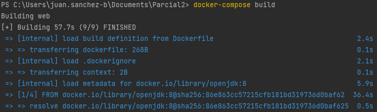
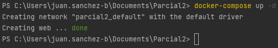
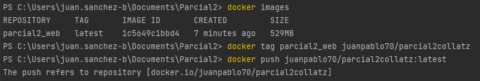
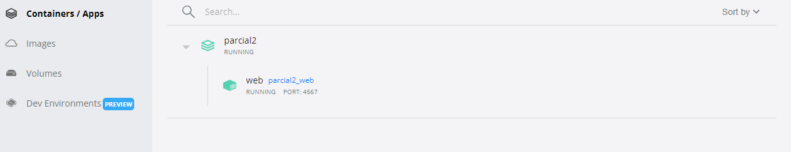
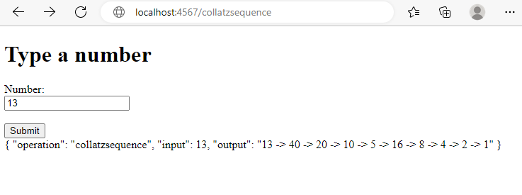
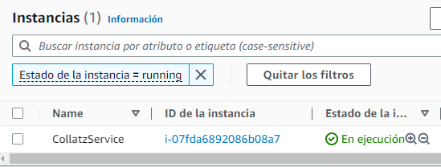
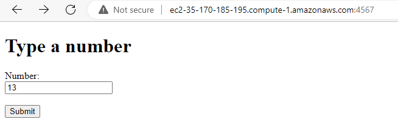
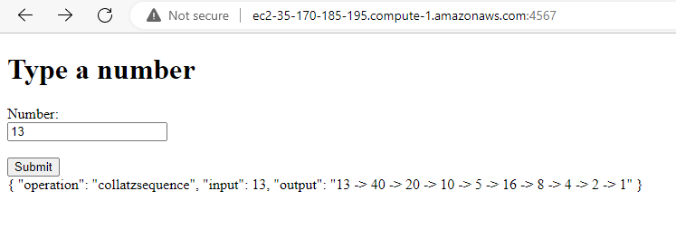
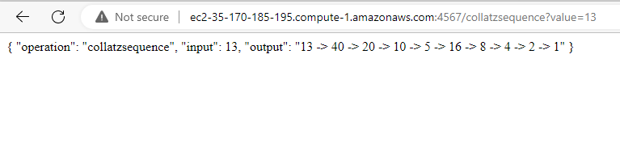

## Escuela Colombiana de Ingeniería
# PARCIAL SEGUNDO TERCIO

Diseñé, construya y despliegue un aplicación web para investigar la conjetura de Collatz. El programa debe estar desplegado en un microcontenedor Docker corriendo en AWS. LAs tecnologías usadas en la solución deben ser maven, git, github, maven, sparkjava, html5, y js. No use liberías adicionales.

```
https://github.com/JuanPablo70/AREP-Parcial-II.git
```

### Prerrequisitos

Para hacer uso de esta aplicación debe tener conocimientos de:
+ Java - Lenguaje de programación orientado a objetos.
+ Maven - Herramienta para automatizar la gestión y construcción de proyectos Java. 
+ AWS - Plataforma de computación en la nube.
+ Docker - Microcontenedores.

## Descripción del proyecto

La conjetura de Collatz dice que si usted crea una secuencia de números, a partir de cualquier entero positivo, siguiendo las reglas descritas abajo, siempre la secuencia terminará en le número 1. Esta conjetura aún no se ha demostrado.

**Las reglas son:**

f(n) = n/2 si n es par.

f(n) = 3n+1 si n es impar.

La secuencia se construye a partir de un número dado k así:

a0 = k

ai = f(ai−1)

Por ejemplo, dato el número k=13 la secuencia sería:

13→40→20→10→5→16→8→4→2→1











## Test









#### Video explicativo en vivo: https://drive.google.com/file/d/1eWNgPnWyxtuVGRl_67kcWuXuOljLgJUq/view?usp=sharing

## Construido con

+ [Maven](https://maven.apache.org/) - Dependency Management
+ [AWS](https://aws.amazon.com/es/) - Cloud Platform

## Versión

1.0

## Autor

Juan Pablo Sánchez Bermúdez
